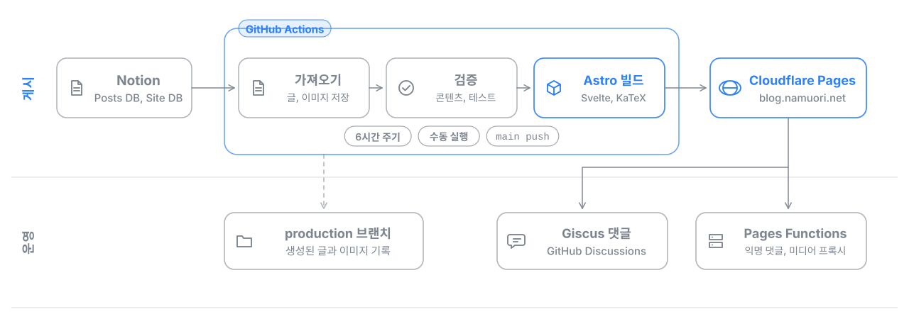

# 나무가든 블로그

[blog.namuori.net](https://blog.namuori.net) | [포트폴리오 namuori.net](https://namuori.net)

연구, 엔지니어링, 지식 관리 노트를 기록하는 블로그의 소스입니다. 글은 Notion에서 쓰고, GitHub Actions가 Markdown으로 변환해 검증한 뒤 Astro로 빌드해 Cloudflare Pages에 배포합니다.



## 주요 기능

- Notion 데이터베이스 기반 글 관리와 6시간 주기 자동 게시
- 카테고리와 태그로 글 사이 관계를 보여 주는 지식 맵 (Svelte)
- 수식(KaTeX), 영상, 오디오 등 Notion 블록 변환
- GitHub 계정 댓글(Giscus)과 선택형 익명 댓글(Cloudflare D1, Turnstile)
- 검색, RSS, 관련 글, SEO 메타데이터

## 기술 스택

| 영역 | 기술 |
| --- | --- |
| 사이트 | Astro 6, Svelte 5, KaTeX |
| 콘텐츠 | Notion API, notion-to-md |
| 배포와 서버 기능 | GitHub Actions, Cloudflare Pages, Pages Functions, D1, KV |
| 개발 도구 | Claude Code, Codex (AI 코딩 에이전트) |

## 브랜치

- `main`: 레이아웃, 컴포넌트, 스크립트, 테스트, Pages Functions 등 소스
- `production`: Actions가 생성한 글과 이미지를 기록하는 배포 브랜치 (직접 수정하지 않음)

## 로컬 개발

Notion 연동 값(`NOTION_TOKEN`, `NOTION_POSTS_DATABASE_ID`, `NOTION_SITE_DATABASE_ID`)을 환경 변수로 지정한 뒤 실행합니다.

```powershell
npm install
$env:CONTENT_SOURCE = "notion"
.\scripts\fetch-content.ps1
.\scripts\fetch-github-profile.ps1
npm run dev
```

검증과 빌드는 `.\scripts\validate-content.ps1`, `npm test`, `npm run build` 순서로 실행합니다.

## 문서

| 문서 | 내용 |
| --- | --- |
| [notion-publishing.md](docs/notion-publishing.md) | Notion 데이터베이스 구조와 변환 규칙 |
| [notion-blocks.md](docs/notion-blocks.md) | 블록별 변환 방식 |
| [cloudflare-pages.md](docs/cloudflare-pages.md) | 배포 설정, Actions 시크릿과 변수 |
| [comments.md](docs/comments.md) | Giscus와 익명 댓글 설정 |
| [media-hosting.md](docs/media-hosting.md) | 미디어 저장 방식 (download, proxy) |
| [custom-domain.md](docs/custom-domain.md) | 커스텀 도메인 연결 |
| [seo-search-console.md](docs/seo-search-console.md) | 검색 엔진 등록 |
| [obsidian-publishing.md](docs/obsidian-publishing.md) | 생성되는 frontmatter 형식 |
